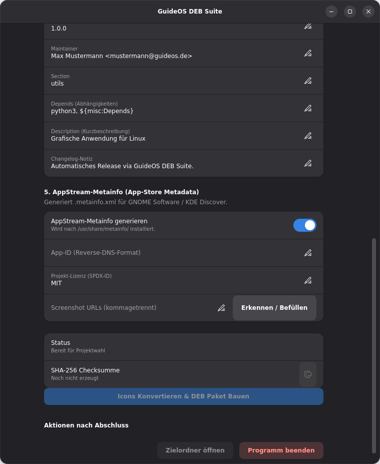

<div style="display:flex; gap:10px;">
  
    
</div>

## 📦 GuideOS DEB Suite
Ein modernes, grafisches GTK4/Libadwaita-Tool zum schnellen und unkomplizierten Erstellen von Debian/Ubuntu-Paketen (.deb) aus Python-Projekten.

Das Tool automatisiert das Erstellen der Debian-Paketstruktur, erkennt Abhängigkeiten, konvertiert PNG-Icons in skalierbare SVG-Formate und baut das finale .deb-Paket über das native dpkg-buildpackage.

## 🌟 Highlights & Features
🎨 Moderne Libadwaita-Benutzeroberfläche: Fügt sich nahtlos in aktuelle GNOME / Linux-Desktop-Umgebungen ein.

🔍 Automatische Abhängigkeitserkennung: Scannt Python-Dateien (ast) nach verwendeten Modulen und schlägt passende Debian-Pakete (python3-gi, python3-requests, etc.) vor.

📐 Automatische Icon-Vektorierung: Wandelt PNG-Icons beim Paketbau über vtracer oder inkscape automatisch in SVGs um und bindet sie nach /usr/share/icons/hicolor/ ein.

🖥️ Desktop-Integration: Generiert auf Wunsch automatisch .desktop-Dateien inkl. Menü- und Icon-Registrierung (postinst / postrm).

⚡ Schlanker Debian-Standard: Nutzt das klassische 3-Zeilen-Standard-Rules-File (dh $@) und die native debian/install-Methode.

🔒 System-Tool-Check: Prüft beim Start, ob alle nötigen Build-Tools (dpkg-dev, debhelper, build-essential) installiert sind und bietet die automatische Installation via pkexec an.

🔐 SHA-256 Prüfsumme: Berechnet nach dem Erstellen automatisch die Checksumme der fertigen .deb-Datei.
---
### 🛠️ Voraussetzungen
Für die volle Funktionalität werden folgende System-Pakete benötigt:
```bash
sudo apt update
sudo apt install python3-gi gir1.2-gtk-4.0 gir1.2-adw-1 dpkg-dev debhelper build-essential
```
(Optional für Icon-Vektorierung):
```bash
sudo apt install inkscape
# ODER via pip:
pip install vtracer
```
## 🚀 Nutzung
1. Skript ausführen:
```bash
python3 guideos_deb_builder.py
```
2. Projektordner wählen: Wähle das Verzeichnis deines Python-Projekts aus.

3. Konfiguration prüfen:
   - Paketnamen, Maintainer und Kurzbeschreibung anpassen.
   - Die automatisch erkannten Abhängigkeiten überprüfen.
   - Haupt-Skript und Icons konfigurieren.
4. Paket bauen: Klicke auf "Icons Konvertieren & DEB Paket Bauen".

5. Fertig: Das fertige .deb-Paket liegt im übergeordneten Ordner deines Projekts bereit.
📂 Struktur der erzeugten PaketeDas Tool installiert dein Projekt standardmäßig nach folgenden Linux-Standardpfaden:Quell-DateiZiel-Pfad auf
dem SystemHauptskript/usr/bin/<paketname>Starter-Datei/usr/share/applications/<paketname>.desktopIcons (SVG)/usr/share/icons/hicolor/scalable/apps/Weitere Python-Module/usr/lib/<paketname>/
## 📂 Struktur der erzeugten Pakete
Das Tool installiert dein Projekt standardmäßig nach folgenden Linux-Standardpfaden:

`Quell-DateiZiel           Pfad auf dem System`    
`Hauptskript              /usr/bin/<paketname>`    
`Starter-Datei            /usr/share/applications/<paketname>.desktop`    
`Icons (SVG)              /usr/share/icons/hicolor/scalable/apps/`   
`Weitere Python-Module    /usr/lib/<paketname>/`
